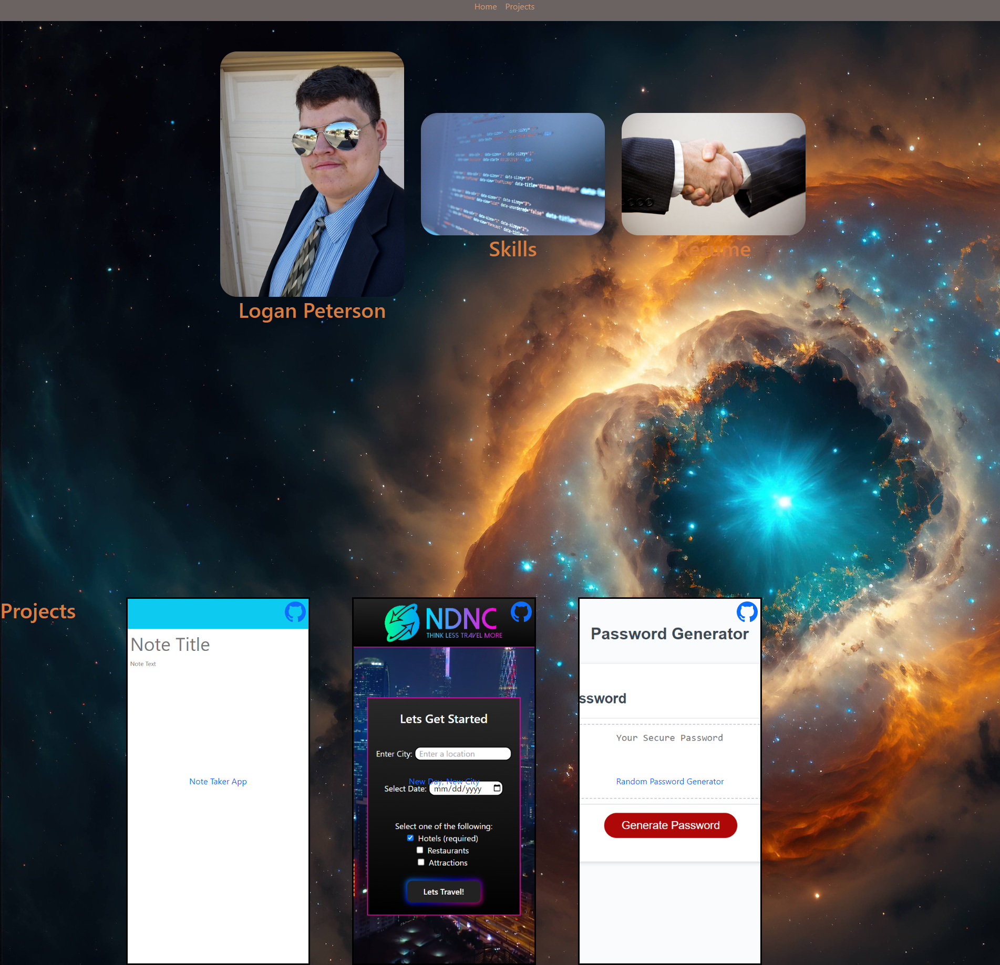

# React Portfolio

## Description

This is a Web Application built with the React JavaScrip Framwork. This is intended to showcase my skills as a developer and give me a centralized location to send potential employers to.

[View The Application Here](https://codedevlogan.github.io/React-Portfolio/)

## Table of Contents

- [Installation](#installation)
- [Usage](#usage)
- [Credits](#credits)
- [Badges](#badges)

## Installation

No installation necessary. Simply access the Portfolio Site [here](https://codedevlogan.github.io/React-Portfolio/)

## Usage

To use the app simply access the deployed application [here](https://codedevlogan.github.io/React-Portfolio/). Once open read through the available information about myself, and maybe even download my resume while you're there.

## Credits

All Non-Framework code and file structuring: [Logan Peterson](https://github.com/codeDevLogan)

## License

Copyright 2023 Logan Peterson

Permission is hereby granted, free of charge, to any person obtaining a copy of this software and associated documentation files (the “Software”), to deal in the Software without restriction, including without limitation the rights to use, copy, modify, merge, publish, distribute, sublicense, and/or sell copies of the Software, and to permit persons to whom the Software is furnished to do so, subject to the following conditions:

The above copyright notice and this permission notice shall be included in all copies or substantial portions of the Software.

THE SOFTWARE IS PROVIDED “AS IS”, WITHOUT WARRANTY OF ANY KIND, EXPRESS OR IMPLIED, INCLUDING BUT NOT LIMITED TO THE WARRANTIES OF MERCHANTABILITY, FITNESS FOR A PARTICULAR PURPOSE AND NONINFRINGEMENT. IN NO EVENT SHALL THE AUTHORS OR COPYRIGHT HOLDERS BE LIABLE FOR ANY CLAIM, DAMAGES OR OTHER LIABILITY, WHETHER IN AN ACTION OF CONTRACT, TORT OR OTHERWISE, ARISING FROM, OUT OF OR IN CONNECTION WITH THE SOFTWARE OR THE USE OR OTHER DEALINGS IN THE SOFTWARE.

## Badges

